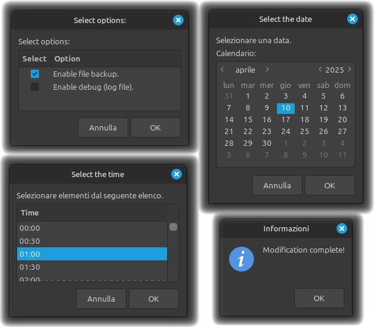

# Change files modification date
=============

Change the Modification Date of Selected Files

DESCRIPTION
-----------

This is a Nemo Action for the Nemo file manager that allows you to change the modification date of selected files via a right-click.

DEPENDENCIES
------------

To run the script correctly, the following dependencies are required:

* `zenity` for dialog windows.  
  Install it with: `sudo apt install zenity`
* `coreutils` contains the touch command to modify the date.  
  Install it with: `sudo apt install coreutils`

INSTALLATION
------------

First of all, install the **necessary packages** (as described above). Then:

**A:** The easiest way to install the nemo action is via "Menu > System Settings > Actions":

1. Download: In Actions, go to "Download" > "Refresh" the availabe actions > search and select the action "Change files modification date" > press the download button
2. Enable: In Actions, go to "Manage" > select the action "Change files modification date" > press the "+" button to enable the action
3. Restart Nemo

**B:** From Cinnamon Spices Website:

1. Download the zip file from the top right
2. Uncompress it into ~/.local/share/nemo/actions

**C:** To install it manually from GitHub:

1. Go to [my Action page](https://github.com/FranzBias/Nemo-Action-Change-files-modification-date)
2. Download the file by clicking on "<> Code" > "Download ZIP"
3. Unzip it in ~/.local/share/nemo/actions
4. Restart Nemo

USAGE
------------

Once installed, right-click on one or more files in Nemo and select "Change modification date".

A dialog will appear to:

* Ask if you want to create a backup (files will be saved with a .bkp extension) and a Debug file. Both, if chosen, will be created in the same folder where the files you selected to modify are located.
* Allow you to select a new modification date using a calendar.
* Allow you to select a time in 30-minute increments.

Finally, confirm and change the modification date.

SCREENSHOTS
---

